# Engineering Harness v1 — Arquitectura, operación y freeze

> **Estado:** FROZEN — v1  
> **Proyecto:** `orders-platform`  
> **Repositorio:** `wlopezob/harness-engineering-ia`  
> **Baseline de freeze:** posterior al merge del PR #35  
> **Fecha de freeze:** 2026-08-18

---

## 1. Resumen ejecutivo

El **Engineering Harness v1** es la capa determinista que convierte las disciplinas de ingeniería del repositorio en un proceso verificable, reproducible y auditable.

Su objetivo no es reemplazar al desarrollador, al reviewer ni a un agente de IA. Su objetivo es proporcionar una respuesta objetiva a preguntas como:

- ¿Qué código exacto fue verificado?
- ¿Qué comando se ejecutó?
- ¿Qué tests y quality gates pasaron?
- ¿El working tree estaba limpio o tenía cambios locales?
- ¿Qué commit era la base?
- ¿Qué exit code produjo la ejecución?
- ¿Dónde quedó la evidencia?
- ¿Bash y Windows se comportan igual?
- ¿Una regresión del propio harness puede bloquear un merge?

La idea central es:

> **El agente puede razonar y proponer. El harness debe medir, verificar y dejar evidencia.**

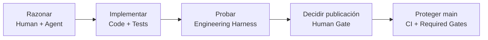

---

## 2. Qué problema resuelve

Antes de esta fase, una afirmación como “el cambio funciona” podía depender de una mezcla de:

- comandos manuales;
- conocimiento implícito del desarrollador;
- contexto de una conversación;
- resultados de CI aislados;
- revisión visual;
- suposiciones sobre qué código había sido realmente probado.

El Harness v1 formaliza estas garantías.

En vez de confiar solo en:

```text
BUILD SUCCESS
```

el flujo queda asociado a:

```text
qué código exacto
+ qué comando
+ qué resultado
+ qué evidencia
+ qué quality gates
+ qué plataforma
```

---

## 3. Qué es y qué NO es

### Es

- una interfaz determinista de verificación;
- una capa de quality gates;
- una fuente de evidencia estructurada;
- una forma de identificar el source exacto;
- una capa con comportamiento equivalente en Bash y Windows;
- una protección del propio proceso mediante self-tests;
- una frontera objetiva para futuros agentes.

### No es

- un agente de IA;
- un planner;
- un reviewer semántico;
- un cliente de GitHub Issues;
- un cliente de Jira;
- un cliente de Azure DevOps;
- un sistema que decide cómo implementar un feature;
- un sistema que hace `git push`, crea PRs o mergea.

---

## 4. Arquitectura general

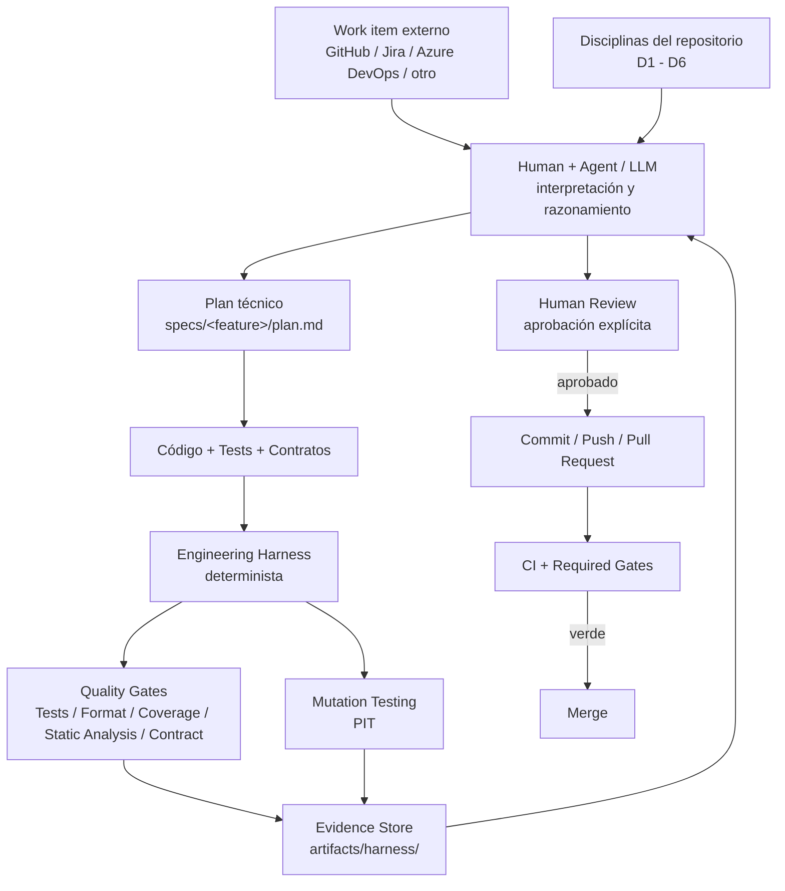

La separación principal es:

```text
CAPA PROBABILÍSTICA
Human / Agent / LLM
        │
        ▼
CAPA DETERMINISTA
Engineering Harness
        │
        ▼
EVIDENCIA OBJETIVA
```

---

# 5. Disciplinas D1–D6

Las disciplinas gobiernan **cómo trabaja el agente o desarrollador**. El harness no reemplaza esas disciplinas; implementa la parte determinista de verificación.

## D1 — External Work Item

El requerimiento vive fuera del harness.

Responsabilidades:

- el work item conserva el **QUÉ**;
- el agente lo lee con las herramientas disponibles;
- no se inventan requisitos;
- assumptions y open questions se declaran;
- GitHub/Jira/Azure DevOps no se integran dentro del CLI del harness.

Principio:

> **La integración con la fuente del requerimiento es capacidad del agente, no responsabilidad del harness.**

---

## D2 — Plan-First

Antes de modificar producción:

1. entender el work item;
2. trabajar en una rama local dedicada cuando aplique;
3. inspeccionar el working tree actual;
4. revisar código relacionado;
5. revisar tests existentes;
6. revisar `CLAUDE.md`;
7. revisar `DECISIONS.md`;
8. revisar `specs/`;
9. revisar contratos;
10. revisar configuración y arquitectura;
11. construir el plan técnico junto con el usuario;
12. esperar aprobación del plan.

Para tareas con más de un comportamiento:

```text
specs/<feature>/plan.md
```

El plan responde:

```text
HOW
```

No reemplaza el work item.

---

## D3 — TDD estricto

Secuencia obligatoria cuando hay comportamiento de producción:

```text
RED → GREEN → TRIANGULATE → REFACTOR
```

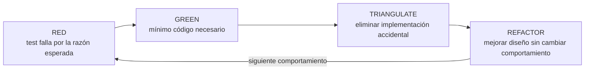

Si un test nuevo pasa a la primera cuando debería haber demostrado un comportamiento inexistente, se considera sospechoso y se endurece.

---

## D4 — Verify

El comando principal es:

```bash
./harness verify
```

Cuando aplica mutation testing:

```bash
./harness mutation
```

Después del verde:

1. self-review;
2. revisar desviaciones y riesgos;
3. presentar resultados;
4. esperar confirmación explícita del usuario.

Hasta recibir esa confirmación no se publica nada remotamente.

---

## D5 — Artifact Store

El chat no es fuente de verdad.

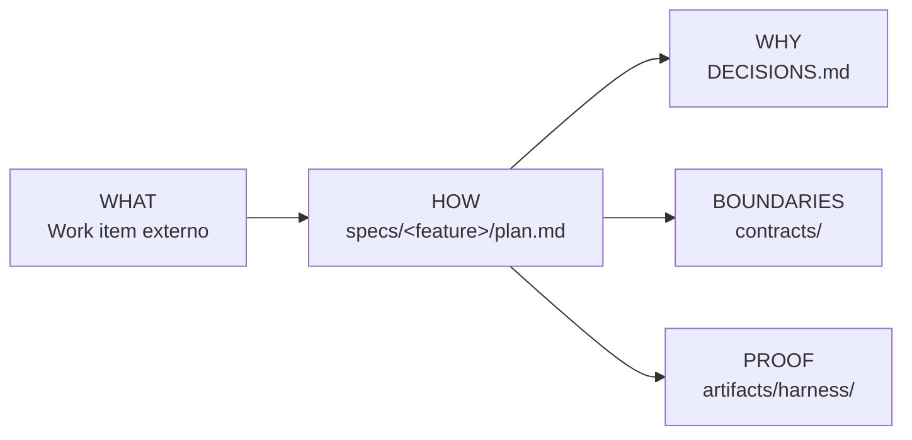

Separación:

| Artefacto | Responsabilidad |
|---|---|
| Work item | QUÉ |
| `plan.md` | CÓMO |
| `DECISIONS.md` | POR QUÉ |
| `contracts/` | Fronteras |
| `artifacts/harness/` | Evidencia |
| Chat | Colaboración temporal |

---

## D6 — Contract-First

La frontera pública entre componentes vive en:

```text
contracts/openapi.yaml
```

Si cambia la API:

```text
código + contrato + tests
```

cambian juntos.

No se considera terminado un cambio de superficie pública si el contrato no representa el nuevo comportamiento.

---

# 6. Interfaz pública del Harness v1

El contrato público es equivalente en Bash y Windows.

| Operación | Bash | Windows |
|---|---|---|
| Verificar | `./harness verify` | `harness.cmd verify` |
| Formatear | `./harness format` | `harness.cmd format` |
| Mutation | `./harness mutation` | `harness.cmd mutation` |
| Source state | `./harness state` | `harness.cmd state` |
| Ayuda | `./harness help` | `harness.cmd help` |

Aliases:

```text
-h
--help
```

Un comando desconocido devuelve error. La superficie pública debe permanecer equivalente entre plataformas.

---

# 7. `verify`: verificación principal

`verify` es el camino principal de validación del backend.

Principio fundamental:

> **La identidad del source se captura antes de Maven.**

Esto evita que los archivos generados por el build cambien retrospectivamente la identidad del código que se afirma haber verificado.

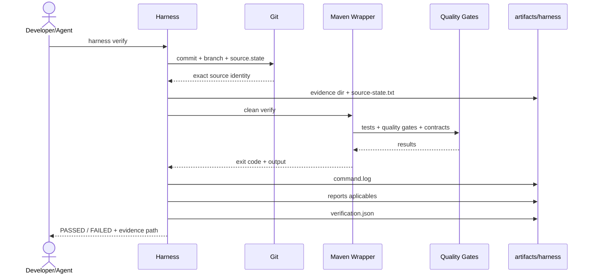

## Estructura típica

```text
artifacts/harness/
└── <timestamp>-<sha>[-dirty-<state7>]/
    ├── verification.json
    ├── source-state.txt
    ├── command.log
    └── test-reports/
        ├── surefire/
        ├── failsafe/
        ├── jacoco/
        └── otros reportes aplicables
```

`verification.json` utiliza schema `1.1`.

Registra, entre otros:

- comando;
- componente;
- resultado;
- exit code;
- inicio;
- fin;
- duración;
- commit;
- branch;
- clean/dirty;
- `source.state`;
- algoritmo;
- scope;
- archivos modificados;
- manifest;
- metadata mínima de CI;
- referencias a evidencia.

---

# 8. Exact Source Identity: `source.state`

Uno de los problemas centrales resueltos fue que:

```text
HEAD
```

no necesariamente representa el código realmente verificado.

Ejemplo:

```text
HEAD = abc123
working tree = abc123 + 5 cambios locales + 2 untracked
```

Guardar solamente `abc123` sería una evidencia engañosa.

Por eso se creó:

```text
source.state
```

---

## 8.1 Scope

```text
repo:tracked+untracked-not-ignored
```

Incluye:

- tracked;
- modificados;
- borrados;
- untracked no ignorados.

No incluye archivos ignorados.

---

## 8.2 Algoritmo

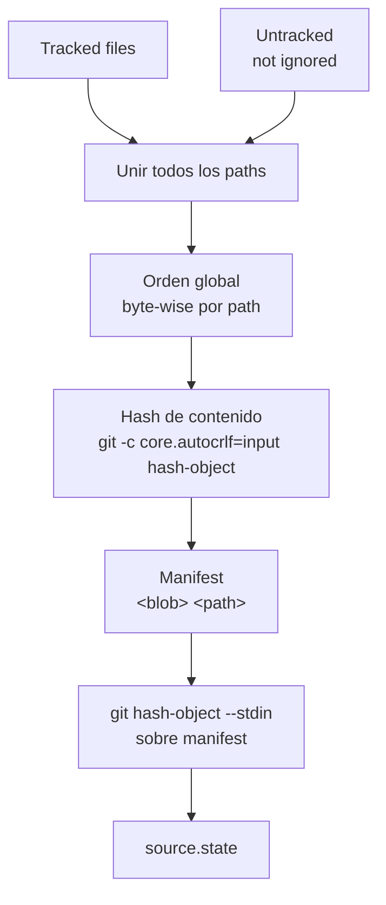

Conceptualmente:

```text
manifest:
<blob-hash> <path>
<blob-hash> <path>
<blob-hash> <path>
...

source.state = git hash-object(manifest)
```

---

## 8.3 Propiedades garantizadas

El diseño busca que:

- mismo contenido ⇒ mismo state;
- diferente timestamp ⇒ mismo state;
- modificación tracked ⇒ state distinto;
- untracked no ignorado ⇒ state distinto;
- archivo ignorado ⇒ no afecta;
- staging sin cambio de contenido ⇒ no afecta;
- Linux y Windows ⇒ mismo state;
- CRLF/LF ⇒ no crea una falsa diferencia;
- locale ⇒ no altera el orden;
- el cálculo no debe mutar el repositorio;
- el manifest permite recomputar y auditar.

---

## 8.4 Manifest auditable

La evidencia conserva:

```text
source-state.txt
```

Se puede recomputar:

```bash
git hash-object --stdin < source-state.txt
```

También permite comparar dos ejecuciones:

```text
diff source-state-A.txt source-state-B.txt
```

para identificar qué archivos cambiaron.

---

# 9. Por qué el scope es todo el árbol versionable

Se aceptó deliberadamente que editar un `.md` pueda cambiar `source.state`.

Esto evita un falso negativo más peligroso:

```text
cambiar ./harness
        +
mantener el mismo state del backend
```

Dos evidencias con el mismo state podrían entonces haber sido generadas por dos harness distintos.

Por eso se priorizó:

> **falso positivo controlado antes que falso negativo de auditabilidad.**

---

# 10. `mutation`: mutation testing auditable

PIT está separado del `verify` normal.

Comando:

```bash
./harness mutation
```

Windows:

```cmd
harness.cmd mutation
```

Proceso lógico:

```text
test-compile
+
org.pitest:pitest-maven:mutationCoverage
```

---

## 10.1 Por qué está separado

Mutation testing:

- es más costoso;
- no necesita ejecutarse en cada ciclo cotidiano;
- se usa cuando cambia lógica cubierta o el plan lo exige.

Por eso no se integró automáticamente a cada PR.

---

## 10.2 Flujo

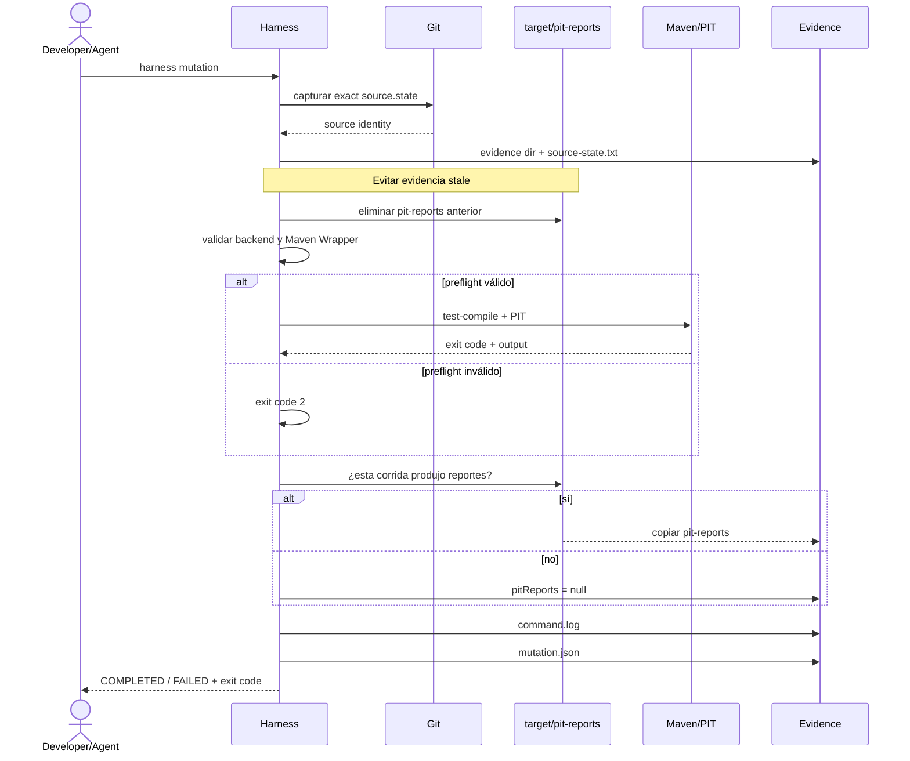

---

# 11. El problema de stale PIT reports

Durante el review del PR de mutation evidence se descubrió un problema serio.

Sin protección:

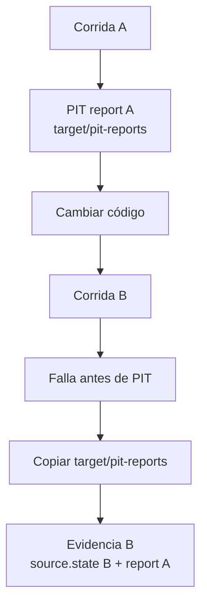

Eso violaba el propósito de la evidencia.

La solución final:

> **Descartar `target/pit-reports` antes de cualquier validación o bifurcación.**

Flujo correcto:

```text
capturar source.state
        ↓
crear evidence dir
        ↓
ELIMINAR reporte PIT previo
        ↓
validar backend/wrapper
        ↓
ejecutar PIT si corresponde
        ↓
copiar solamente lo producido después
```

Se cubrió además el caso:

```text
stale report + Maven Wrapper ausente
```

Resultado correcto:

```text
exit code = 2
evidence creada
pit-reports/ NO existe en la evidencia
mutation.json.evidence.pitReports = null
```

---

# 12. Evidencia de mutation

Estructura típica:

```text
artifacts/harness/
└── <timestamp>-<sha>[-dirty-<state7>]-mutation/
    ├── mutation.json
    ├── source-state.txt
    ├── command.log
    └── pit-reports/
        ├── index.html
        ├── mutations.xml
        └── ...
```

Si la corrida no produjo reporte:

```json
{
  "evidence": {
    "pitReports": null
  }
}
```

`mutation.json` usa un schema propio:

```text
1.0
```

independiente de `verification.json`.

---

# 13. Modelo de evidencia

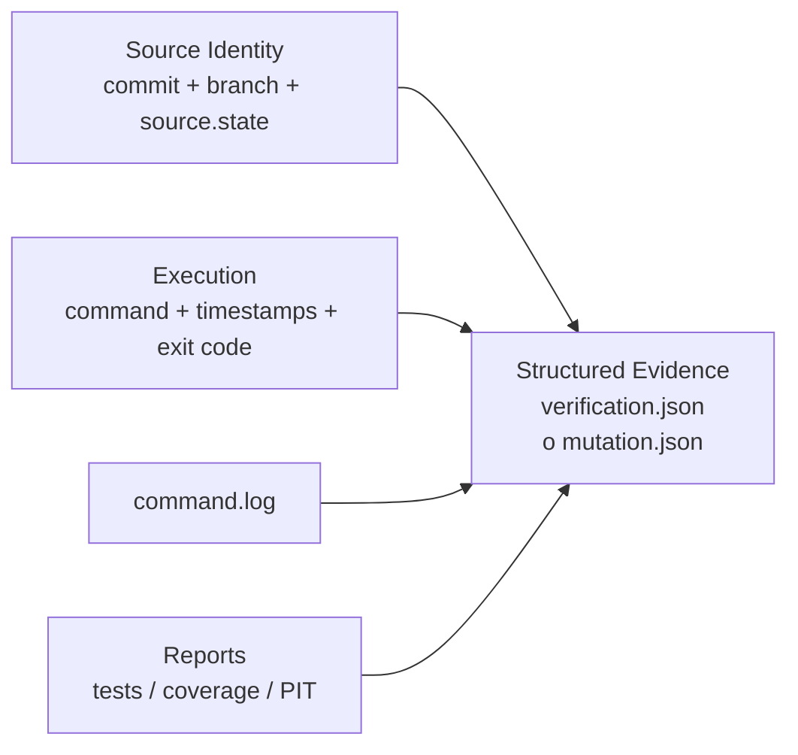

La evidencia debe responder:

> **¿Qué resultado obtuvimos, ejecutando qué comando, sobre qué código exacto?**

---

# 14. Bash ↔ Windows: paridad de comportamiento

El Harness v1 tiene dos implementaciones:

```text
./harness
harness.cmd
```

No se exige implementación idéntica.

Se exige:

```text
mismas entradas
→ mismo contrato observable
→ misma semántica
```

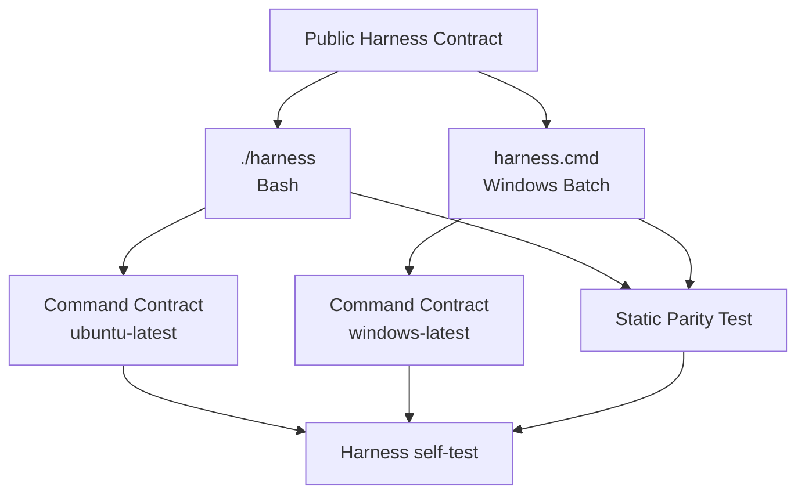

---

# 15. Dos capas de tests de paridad

## 15.1 `tests/harness/contract_test.sh`

Una sola suite se ejecuta contra:

```text
HARNESS_IMPL=bash
HARNESS_IMPL=cmd
```

Valida comportamiento real:

- command surface;
- help;
- comandos desconocidos;
- sensibilidad a mayúsculas;
- wrapper correcto;
- argumentos de Maven;
- exit codes;
- banners;
- JSON parseable;
- `durationSeconds`;
- evidencia;
- mutation evidence;
- stale reports;
- errores internos del intérprete.

En Windows:

```text
Git Bash
    ↓
cmd //c harness.cmd ...
```

---

## 15.2 `tests/harness/parity_test.sh`

Valida estáticamente:

- mismos comandos despachados;
- help equivalente;
- mismos argumentos Maven;
- wrapper correcto por plataforma;
- schema equivalente;
- mismo archivo `mutation.json`;
- referencia PIT calculada;
- descarte stale;
- descarte stale antes de validaciones.

Sirve para detectar drift incluso antes de ejecutar Windows.

---

# 16. Lo que Windows encontró de verdad

La primera ejecución real y luego las suites de contrato encontraron defectos preexistentes que una revisión visual no detectó.

Entre ellos:

### GNU `find` vs Windows `find.exe`

Bajo Git Bash, `find` podía resolver al ejecutable GNU y no al de Windows.

Consecuencia:

```text
verify/state podían colgarse
```

Solución:

```text
%SystemRoot%\System32\find.exe
```

---

### Aritmética de Batch dentro de bloques

Expresiones complejas de `set /a` podían ser interpretadas como cierres de bloques.

---

### `exit /b` anidado

Un camino podía devolver un código distinto al esperado.

---

### `%TIME%` y horas de un dígito

Ejemplo:

```text
" 0:22:11.13"
```

El espacio inicial producía:

```text
Unbalanced parenthesis.
```

y `durationSeconds` podía quedar en `0`.

Peor aún: inicialmente el banner final podía seguir diciendo:

```text
HARNESS RESULT: PASSED
```

La solución fue eliminar el parsing de `%TIME%` y usar epoch UTC.

---

### Regla incorporada

> **Una corrida con errores internos del intérprete nunca puede considerarse verde.**

---

# 17. Harness Self-Test

El harness está protegido por sus propios tests:

```text
tests/harness/
├── state_test.sh
├── contract_test.sh
├── parity_test.sh
├── selftest_gate_test.sh
└── testlib.sh
```

Baseline del freeze:

```text
state_test.sh          16 passed
contract_test.sh       23 passed
parity_test.sh          8 passed
selftest_gate_test.sh  10 passed
```

---

# 18. Required Harness Self-Test Gate

Tener jobs verdes no bastaba si una regresión del harness no bloqueaba merge.

Por eso se agregó un aggregate gate con nombre estable:

```text
Harness self-test
```

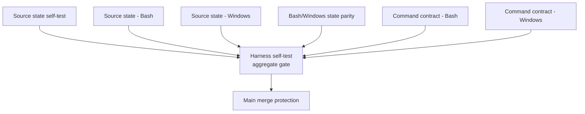

El gate usa semántica estricta:

```text
success   → aceptado
failure   → rojo
cancelled → rojo
skipped   → rojo
invalid   → rojo
```

No debe existir un “pasar por defecto”.

El proyecto configuró/documentó como required checks:

```text
Maven verify
Dependency review
Harness self-test
```

---

# 19. Quality Gates construidos durante la fase

| Gate | Propósito |
|---|---|
| Unit / integration tests | Comportamiento |
| Spotless | Formato |
| JaCoCo | Cobertura |
| SpotBugs | Análisis estático |
| Dependency Review | Riesgo de nuevas dependencias |
| CodeQL | Seguridad / análisis de código |
| OpenAPI contract/fidelity | Contrato público |
| PIT | Calidad real de tests |
| Harness Self-Test | Calidad del propio harness |

PIT permanece separado del `verify` cotidiano.

---

# 20. Workflow completo de una funcionalidad

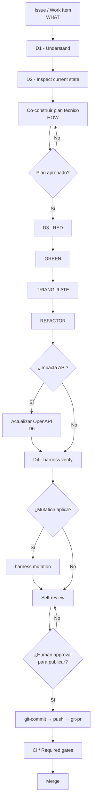

---

# 21. Skills de Git: capacidades, no comandos del harness

Durante la fase se incorporaron skills reutilizables:

```text
git-branching
git-commit
git-pr
```

Estas skills pertenecen a las capacidades del agente.

No son:

```text
./harness branch
./harness commit
./harness push
./harness pr
```

Principio:

> **Las disciplinas orquestan las capacidades del agente; las capacidades no necesitan conocer las disciplinas del repositorio.**

---

# 22. Gate humano de publicación

El proceso separa:

```text
verificar
```

de:

```text
publicar
```

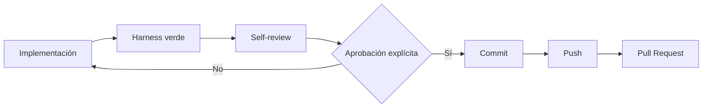

Hasta la aprobación:

```text
NO push
NO PR
NO remote publication
```

---

# 23. El Harness no es el Agentic Workflow

Esta separación forma parte del freeze.

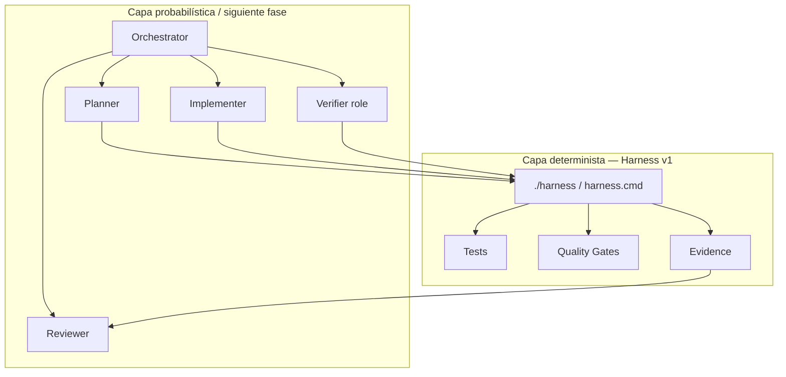

No se agregan comandos como:

```text
./harness agent
./harness planner
./harness implement
```

Los agentes estarán **encima** del harness.

---

# 24. Validación con funcionalidades reales

El Harness v1 no se validó solamente modificando infraestructura.

También se utilizó para desarrollar features reales del inventario.

---

## 24.1 PR #22 — Stock adjustment individual

Se agregó:

```text
POST /inventory/products/{id}/stock-adjustments
```

Atravesó:

- dominio;
- application;
- REST;
- contrato OpenAPI;
- tests;
- JaCoCo;
- SpotBugs;
- mutation testing.

Baseline documentado:

```text
48 tests
mutation score: 91%
test strength: 97%
```

PIT encontró un test débil en un boundary y obligó a fortalecerlo.

---

## 24.2 PR #25 — Stock movements + atomicidad + soft delete

Se incorporó:

- historial de movimientos;
- transacción atómica;
- `Clock` inyectado;
- soft delete;
- invariante del stock;
- evolución contract-first del `PUT`.

Baseline:

```text
65 tests
mutation score: 93%
test strength: 97%
```

---

## 24.3 PR #33 — Bulk stock adjustments atómicos

Este fue el principal **end-to-end proof** del Harness.

El requerimiento pedía múltiples ajustes como una sola operación.

Una implementación ingenua podía hacer:

```text
actualizar A
    ↓
fallar B
    ↓
A queda modificado
```

El TDD lo detectó.

El diseño terminó con:

```text
validar lote
    ↓
cargar todos
    ↓
calcular todos
    ↓
solo entonces escribir
```

SpotBugs también detectó una exposición de representación y obligó a mover invariantes al constructor compacto.

El contrato OpenAPI se actualizó junto con producción.

Resultado documentado:

```text
90 tests
47 mutations
44 killed
94% mutation score
98% test strength / mutated-class coverage reportada
```

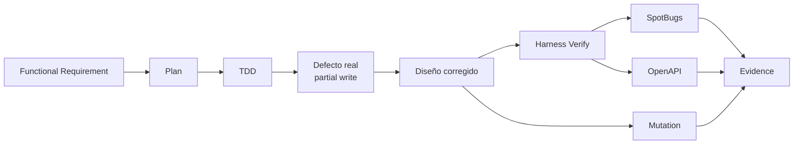

Esto demostró que el harness influye positivamente sobre la calidad del diseño, no solo sobre el pipeline.

---

# 25. Evolución de la fase

```mermaid
flowchart LR
    A["Backend CI"] --> B["Unified verify"]
    B --> C["Structured evidence"]
    C --> D["Spotless"]
    D --> E["JaCoCo"]
    E --> F["PIT"]
    F --> G["Dependency Review"]
    G --> H["SpotBugs / CodeQL"]
    H --> I["D1-D6"]
    I --> J["Git skills"]
    J --> K["Functional proofs"]
    K --> L["Exact source.state<br/>PR #27"]
    L --> M["Required self-test gate<br/>PR #29"]
    M --> N["Bash/Windows parity<br/>PR #31"]
    N --> O["Mutation evidence<br/>PR #35"]
    O --> P["HARNESS v1 FROZEN"]
```

PRs de referencia:

| PR | Hito |
|---|---|
| #16 | Lifecycle artifacts y WHAT/HOW |
| #22 | Feature funcional bajo D1-D6 |
| #25 | Atomicidad, historial y contrato |
| #27 | Exact `source.state` |
| #29 | Required `Harness self-test` |
| #31 | Bash/Windows behavioral parity |
| #33 | Prueba funcional end-to-end |
| #35 | Structured mutation evidence |

---

# 26. Decisiones estructurales de v1

## 26.1 Work items fuera del harness

No se integran proveedores en el CLI.

```text
GitHub/Jira/Azure
        ↓
Agent capability
        ↓
Requirement understanding
```

---

## 26.2 WHAT / HOW / WHY separados

```text
Issue       = WHAT
plan.md     = HOW
DECISIONS   = WHY
contracts   = boundaries
artifacts   = evidence
```

---

## 26.3 Exact state sobre commit solamente

Un commit no describe un working tree dirty.

---

## 26.4 Paridad medida

Windows debe ejecutar el contrato real.

---

## 26.5 Gate agregado

El ruleset se acopla a un check estable:

```text
Harness self-test
```

y no a cada detalle interno del workflow.

---

## 26.6 Schemas separados

```text
verification.json → schema 1.1
mutation.json     → schema 1.0
```

Pueden evolucionar independientemente.

---

## 26.7 Stale PIT report imposible por construcción

Se limpia antes de la primera bifurcación.

---

# 27. Quick Start

## Estado exacto

```bash
./harness state
```

Con manifest:

```bash
./harness state --manifest /tmp/source-state.txt
```

> El manifest debe escribirse preferentemente fuera del repositorio, porque un archivo nuevo dentro del repo pasaría a formar parte del siguiente state.

---

## Formato

```bash
./harness format
```

---

## Verificación

```bash
./harness verify
```

Resultado esperado:

```text
HARNESS RESULT: PASSED
Source: ...
Evidence: artifacts/harness/...
```

---

## Mutation

```bash
./harness mutation
```

Resultado esperado:

```text
MUTATION RESULT: COMPLETED
Evidence: artifacts/harness/...-mutation
```

---

## Windows

```cmd
harness.cmd state
harness.cmd format
harness.cmd verify
harness.cmd mutation
```

---

# 28. Orden recomendado para revisar el código

Para un nuevo reviewer:

1. `orders-platform/CLAUDE.md`
2. `harness`
3. `harness.cmd`
4. `tests/harness/state_test.sh`
5. `tests/harness/contract_test.sh`
6. `tests/harness/parity_test.sh`
7. `tests/harness/selftest_gate_test.sh`
8. `.github/workflows/harness-selftest.yml`
9. `.github/scripts/needs_all_succeeded.sh`
10. `orders-platform/DECISIONS.md`
11. `orders-platform/specs/github-26/plan.md`
12. `orders-platform/specs/github-28/plan.md`
13. `orders-platform/specs/github-30/plan.md`
14. `orders-platform/specs/github-34/plan.md`
15. `orders-platform/specs/github-32/plan.md` / PR #33

---

# 29. Qué significa FROZEN v1

Frozen no significa “prohibido tocar”.

Significa:

> **No se agregan capabilities al harness por defecto.**

Un cambio al Harness v1 debe estar justificado por:

- bug real;
- vulnerabilidad;
- incompatibilidad de plataforma;
- actualización técnica necesaria;
- necesidad descubierta en trabajo funcional;
- problema de auditabilidad;
- regresión de contrato.

No son razón suficiente:

- “sería interesante”;
- “podríamos guardar una métrica más”;
- “podríamos agregar otro comando”;
- “quizá un futuro agente lo necesite”.

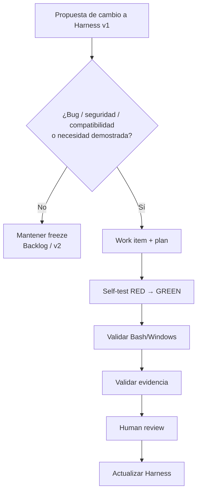

---

# 30. Fuera de v1

## Environment identity

Backlog/v2 posible:

- Java version;
- Maven version;
- OS;
- PIT version;
- runner image;
- otras propiedades de entorno.

No bloquea v1 porque ya se puede identificar **qué source exacto** fue probado.

---

## UX menor de mutation

Existe una mejora posible:

```json
"pitReports": null
```

es correcto cuando no hubo reportes, aunque la consola todavía puede mostrar una ruta `Report:` potencial.

Es una inconsistencia de presentación, no de evidencia.

---

## También fuera de v1

- mutation incremental;
- mutation en cada PR;
- dashboards;
- provider adapters;
- agentes dentro del CLI;
- orquestación agentic dentro de `./harness`.

---

# 31. Próxima fase: Agentic Engineering Workflow

El freeze permite colocar agentes sobre una base estable.

Roles lógicos:

```text
Planner
Implementer
Verifier
Reviewer
Orchestrator
```

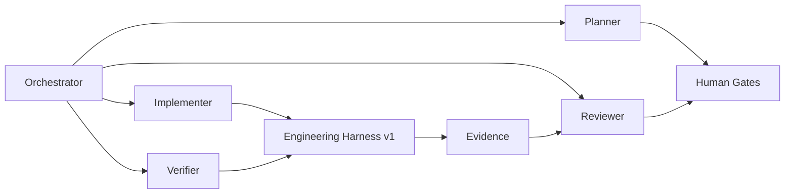

El agente no reemplaza al harness.

El harness no reemplaza al agente.

---

# 32. Garantías del Harness v1

### G1 — Exact source identity

Cada ejecución puede identificar el código exacto sobre el que se ejecutó.

### G2 — Identidad auditable

`source-state.txt` permite recomputar `source.state`.

### G3 — Paridad Bash/Windows

Mismo contrato observable, ejecutado realmente en ambas plataformas.

### G4 — Self-protection

Una regresión del propio harness puede dejar rojo el merge gate.

### G5 — Structured verify evidence

```text
verification.json
source-state.txt
command.log
reports
```

### G6 — Structured mutation evidence

```text
mutation.json
source-state.txt
command.log
pit-reports
```

### G7 — No stale PIT evidence

Un reporte de una corrida anterior no debe poder asociarse silenciosamente con un state nuevo.

### G8 — Provider independence

El harness no depende de GitHub/Jira/Azure DevOps.

### G9 — LLM independence

Las garantías deterministas no dependen de un modelo específico.

### G10 — Human publication control

Verificar no equivale a publicar.

---

# 33. Baseline de freeze

Último baseline documentado al cerrar la fase:

```text
Backend verify:
90 tests
0 failures
0 errors
0 skipped
```

Mutation:

```text
47 mutations
44 killed
94% mutation score
98% test strength / mutated-class coverage reportada
```

Harness self-tests:

```text
state_test.sh          16 passed
contract_test.sh       23 passed
parity_test.sh          8 passed
selftest_gate_test.sh  10 passed
```

Estos números son una fotografía del freeze, no una promesa de que el número de tests nunca cambiará.

---

# 34. Criterio de cierre de la fase

La fase se considera completada porque existe:

```text
Requirement discipline
+
Plan-first
+
Strict TDD
+
Contract-first
+
Unified verification
+
Quality gates
+
Exact source identity
+
Structured verify evidence
+
Structured mutation evidence
+
Bash/Windows parity
+
Harness self-test
+
Required merge gate
+
Human publication gate
+
Real functional proof
```

La siguiente inversión de ingeniería debe concentrarse en **usar esta plataforma estable**, no en seguir agregando infraestructura sin necesidad demostrada.

---

# 35. Conclusión

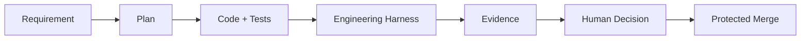

En una frase:

> **El Engineering Harness v1 hace que “funciona” deje de ser una opinión del agente y se convierta en una afirmación respaldada por ejecución real, identidad exacta del código y evidencia auditable.**

---

# 36. Referencias principales

## Pull Requests

- PR #16 — lifecycle artifacts / WHAT vs HOW.
- PR #22 — stock adjustments.
- PR #25 — stock movement history, atomicidad y soft delete.
- PR #27 — exact source state.
- PR #29 — required Harness Self-Test gate.
- PR #31 — Bash/Windows behavioral parity.
- PR #33 — bulk atomic stock adjustments, functional proof.
- PR #35 — structured mutation evidence.

## Archivos clave

```text
harness
harness.cmd
orders-platform/CLAUDE.md
orders-platform/DECISIONS.md
orders-platform/specs/
orders-platform/contracts/openapi.yaml
tests/harness/
.github/workflows/backend-verify.yml
.github/workflows/harness-selftest.yml
.github/scripts/needs_all_succeeded.sh
artifacts/harness/
```

---

## Estado final

```text
ENGINEERING HARNESS v1
STATUS: FROZEN
NEXT PHASE: AGENTIC ENGINEERING WORKFLOW
```
